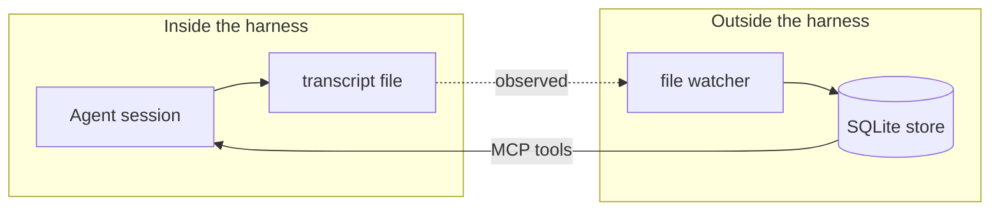
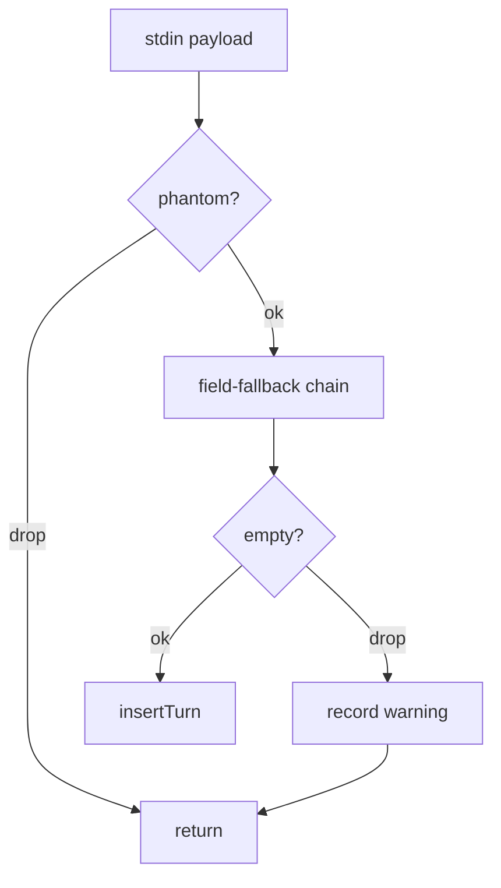
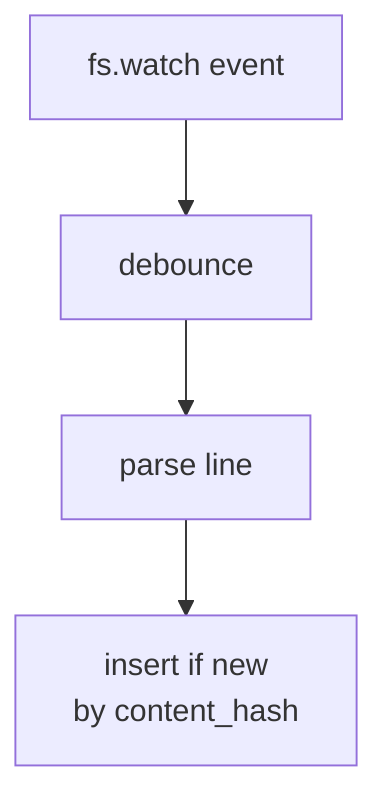

# Decoupling agent memory from the harness

I work across several agent harnesses on different projects — different ones for different jobs, sometimes more than one in the same day. Each manages memory its own way. Switching harnesses meant starting blank.

That mattered because the sessions themselves were valuable. Not the model output — the trail. The questions. The decisions. The dead ends. Tools shift faster than I can settle on one, and the trail is the one thing that travels across them. Stored and searchable, the trail also becomes its own dataset — patterns across sessions, recurring problems, where my thinking changed. The work itself, made reviewable.

The transcripts existed. Every harness writes its conversation to disk somewhere. But each wrote it in its own format, in its own directory, with IDs that meant something only to itself. The data was right there. It just wasn't mine.

My goal was a record on my terms: persistent, searchable, not tied to any one harness, and detached from the model's execution lifecycle so it kept working when the model didn't.

The result is ai-memory: a watcher, a local store, one search layer — harness-agnostic by construction.



## Memory is infrastructure

An agent loop has a short, contained life — a single session inside a single harness. The memory it produces should not. It needs to outlive each session and span every harness, ready for use by consumers that don't exist yet: another agent, the human, a search tool. Lifecycle, scope, and consumer surface are all wider for memory than for the loop. That difference is what makes memory infrastructure rather than a feature.

Storing memory inside the harness inherits the harness's scope, lifecycle, and access surface — none of which match what memory needs. The fix is to invert the relationship: the memory layer stays put, the harness becomes one of its consumers.

Two consequences follow. Capture should be a separate concern from inference — the raw layer should not depend on any one consumer's judgment about what matters. And the right place to capture from is whatever the harness commits to keeping stable, which today is rarely its event API.

## Separate capture from inference

Capture is recording what happened: turns, timestamps, content, the IDs that link them. Its single correctness criterion is completeness — every turn lands in the store, deterministically and idempotently.

Inference is everything done on top: summarization, salience scoring, retrieval, classification. Its correctness criteria — usefulness, recall, precision — evolve over time as models and consumers change.

When inference is folded into capture, the record becomes a derivative of one consumer's judgment at one point in time. A new summarizer cannot re-run over the old turns, because they are already filtered. A second consumer cannot retrieve what the first one dropped. Capture, baked together with inference, becomes lock-in to the model that did the baking.

Kept apart, both layers move on their own timeline. The record stays usable across changes to either.

## Hooks lack a shared contract

The first version of ai-memory captured through hooks. Each harness exposes a way to register a script that fires on lifecycle events — prompt submitted, response returned, session ended. The script gets a structured payload on stdin, can emit context back on stdout, and runs synchronously inside the harness. The ergonomics are right.

Edges kept appearing. Field-shape adapters per harness, silent-failure detection, phantom-firing detection, drift detection, health-warning surfacing — every failure mode needed its own defensive layer. The flow inside a single hook ended up looking like this:

```
on UserPromptSubmit:
  payload   ← parseStdin()                     # per-harness adapter
  if isPhantomFiring(payload): return          # dedup
  prompt    ← payload.prompt
              ?? payload.userMessage
              ?? payload.messages?.[0].text    # field-fallback chain
  if prompt is empty:
    recordHealthWarning("empty prompt field")
    return
  insertTurn(payload.sessionId, "user", prompt)
```

Across the whole system:

| | Lines |
|---|---:|
| Defensive infrastructure (adapters, phantom detection, drift checks, health warnings, hook config, CLI parsing) | ~1,075 |
| Actual capture logic | ~100 |

The defensive layer was an order of magnitude larger than the thing it defended.

File watching also needs N parsers — one per harness transcript format. That part doesn't go away. What does go away is the defensive layer. Transcript files are what the harness writes for itself, not for an external consumer; they're a persistence format, not a public API, and the harness keeps them stable for its own reasons. When the format changes, the parse fails loudly with a stack trace and a file path. There's no registration to maintain, no phantom events to deduplicate, no drift to detect, no silent empty fields.



*The hook capture flow at its peak defensive complexity.*

The shape of hooks is still right. The standardization isn't there yet, and hook-based capture grows defensive infrastructure faster than it grows capability.

## Picking the capture surface

A well-maintained public API would be the better choice. It's documented, versioned, comes with a deprecation policy, and is designed for external consumers — exactly what capture needs. Hooks have all those properties in principle.

The transcripts already existed on disk. Reading them collapsed the whole capture path to a small loop:

```
on fs.watch(transcript_dir) event:
  debounce 500ms                       # collapse bursts
  for each changed file:
    for each JSONL line:
      turn = parse_line()
      insert_if_new(turn, by content_hash)
```

One JSONL line, with what each field becomes:

```jsonc
{
  "type": "user",                              // record type
  "sessionId": "abc-123",                      // → external_id (the conversation lookup key)
  "message": {
    "role": "user",                            // → role
    "content": "refactor the import service"   // → content; sha256 → content_hash
  },
  "timestamp": "2026-05-10T14:21:33.045Z"      // → created_at
}
```

A unique index on `(content_hash, conversation_id)` makes re-importing the same line a silent no-op.

No registration. No per-harness adapter. No phantom-fire dedup. No drift detection. The watcher + parser is small enough to hold in your head.

It runs on the same machine where I use the IDE. If a transcript format changes, the parse fails the next time the IDE writes, and the failure is visible in the dashboard within the same session.



*The file-watch capture flow at its current shape.*

The trade-offs are real. File watching is wired to the local filesystem — it works where the IDE writes its transcripts, and not elsewhere. Hooks, by contrast, run wherever the harness runs, which makes them more self-contained and portable across hosted or remote execution. And if the harness vendors ever publish a portable hook standard, the calculus flips entirely: a standard API beats reading someone else's persistence.

## The shape of the system

The system that comes out of these choices has four parts.

**Storage** — a single SQLite file with FTS5 full-text search. No service, no daemon, no infrastructure. The full transcript is preserved; nothing is decayed or archived. Search is BM25 over the turns FTS index.

```sql
CREATE TABLE conversations (
  id              TEXT PRIMARY KEY,
  external_id     TEXT UNIQUE,         -- the harness's own session id
  workspace       TEXT,
  ide             TEXT,                -- which harness produced this
  source_path     TEXT,                -- the JSONL file the watcher read
  title           TEXT,
  summary         TEXT,
  turn_count      INTEGER NOT NULL DEFAULT 0,
  started_at      TEXT NOT NULL,
  updated_at      TEXT NOT NULL
);

CREATE TABLE turns (
  id              TEXT PRIMARY KEY,
  conversation_id TEXT NOT NULL REFERENCES conversations(id),
  role            TEXT NOT NULL CHECK(role IN ('user','assistant','system')),
  content         TEXT NOT NULL,
  content_hash    TEXT NOT NULL,
  turn_number     INTEGER NOT NULL DEFAULT 0,
  created_at      TEXT NOT NULL
);
```

**Capture** — the file watcher described in the previous section. Embedded in the MCP server process so it runs whenever the IDE is open. Idempotent imports keyed on content hash. Errors surface in the dashboard's health-warnings section.

**Consumers** — the same store, exposed through four interfaces:

- **MCP server** — the agent's surface. Five tools, all callable from inside a session. The most-called is `ai-memory-search`:

  ```ts
  // input
  { query?: string; workspace?: string; date_from?: string;
    date_to?: string; role?: 'user' | 'assistant';
    limit?: number; offset?: number }

  // output
  { conversations: Array<{
      id, title, summary, workspace, ide, started_at, turn_count,
      match_source: 'turn' | 'summary' | 'title',
      matching_turns: Array<{ role, content, turn_number }>
    }>;
    total: number }
  ```

  The other four — `ai-memory-conversations` (list), `ai-memory-conversation` (full transcript), `ai-memory-summarize` (write summary), `ai-memory-status` (health) — follow the same shape: typed input, structured output, no side effects on the store beyond what the tool name implies.
- **CLI** — the human's primary surface. Commands for search, listing, summary writing, status. Also usable by scripts and cron.
- **Dashboard** — the human's visual surface. A local web UI for browsing conversations, searching, inspecting health.
- **Direct SQLite read** — for any other tool. The database file is plain SQLite; any process that can read a file can query it.

Each interface is independent. Swapping the agent's protocol (MCP today, something else tomorrow) doesn't touch the CLI, the dashboard, or external readers. None depend on the others existing.

**Enrichment** — a single per-conversation summary. Written by the LLM (via the `ai-memory-summarize` tool) or by the human (via CLI). Latest write replaces the previous; the LLM is instructed to write progressively, carrying forward what's still relevant. Conversations without a summary are still searchable in full. The summary is the only LLM-written artifact; everything else in the store is captured deterministically.

## Operational notes

Three things keep the system robust in everyday use:

```
on MCP server start:
  open SQLite with WAL mode + 5s busy timeout
  scan all watched dirs for new transcripts   # catch-up after offline time
  start fs.watch on each dir                  # debounced 500ms per file
```

**Multiple IDEs at once.** Each open IDE spawns its own MCP server, and each watcher points at the same SQLite file. WAL mode plus the busy timeout make concurrent writes safe. The content-hash dedup makes them idempotent.

**Noisy watcher events.** A filesystem write can trigger several watcher events on macOS. The 500 ms debounce collapses them into a single re-import per file. Dedup handles anything that still slips through.

**Catching up after downtime.** When the MCP server starts, it scans the watched directories before accepting tool calls — picking up whatever was written while it was offline (restarts, sleep, IDEs that opened first).

## The harness will change

Harnesses change. Hooks change. Protocols change. Models change. The capture path may shift from file watching to something else if a portable hook standard arrives. The agent's MCP layer may be replaced by whatever the next agent protocol turns out to be.

The store doesn't change. The same tables, written deterministically from whatever serialized output the next harness exposes for itself. A new harness becomes a new transcript parser — a few hundred lines, isolated from everything else.

The conversations from years ago remain searchable. The summaries written by today's model remain readable when the model is gone. The patterns visible across the whole record are visible from one place, not divided among the tools that produced them.

That's the part worth owning.
